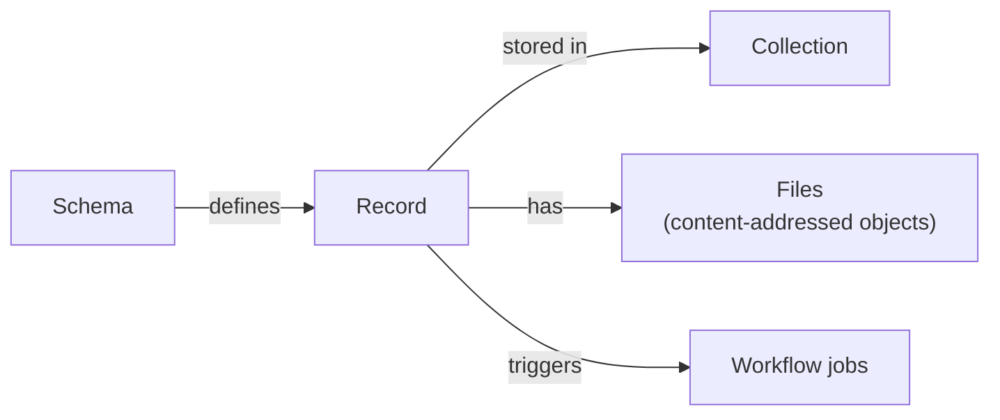

# civex

A local-first, command-line research data management system. Define schemas, collect records into collections, attach files, and automate processing with workflows — all on your own machine, with an optional web UI and HTTP server.



## Install

```bash
pipx install "civex[server,workflows]"
```

See [Install](docs/getting-started/install.md) for the full list of extras and upgrading.

## 60-second example

```bash
civex init
civex schema create trial --description "A single experimental trial"
civex schema add-field trial subject --type string --required
civex collection create study-2024
civex record add --to study-2024 --schema trial
civex serve                          # open http://localhost:8000
```

Take the [five-minute tour](docs/getting-started/tour.md) for the full walkthrough, including workflows.

## Documentation

Full docs live in [`docs/`](docs/index.md) — run `make docs` to browse them locally with live reload.

- **Getting started** — [install](docs/getting-started/install.md), [your first project](docs/getting-started/first-project.md), [five-minute tour](docs/getting-started/tour.md)
- **Guides** — [schemas & fields](docs/guides/schemas-and-fields.md), [collections & records](docs/guides/collections-and-records.md), [files](docs/guides/files.md), [workflows](docs/guides/workflows.md), [automation](docs/guides/automation.md), [server & web UI](docs/guides/server-and-web-ui.md), [remote sync](docs/guides/remote-sync.md), [PostgreSQL](docs/guides/postgresql.md), [logging & telemetry](docs/guides/logging-and-telemetry.md)
- **Reference** — [plugins](docs/_prose/plugins/), [writing a plugin](docs/extending/writing-a-plugin.md), [container plugins](docs/extending/container-plugins.md), [wire protocol](docs/extending/wire-protocol.md), [plugin SDK](docs/extending/sdk-reference.md)
- **Contributing** — [dev setup](docs/contributing/dev-setup.md), [architecture](docs/contributing/architecture.md), [testing](docs/contributing/testing.md), [release process](docs/contributing/release.md), [publishing the docs site](docs/contributing/publishing-docs.md); see [CONTRIBUTING.md](CONTRIBUTING.md) for the short version

## Development

```bash
make install   # uv sync — sets up the venv and dependencies
make check     # everything CI runs: format, lint, typecheck, test, docs build
```

See [dev setup](docs/contributing/dev-setup.md) for the full local development workflow.

## License

civex is free to use for any purpose, including commercial use. Redistribution and modification are not permitted. See [LICENSE](LICENSE) for full terms.
