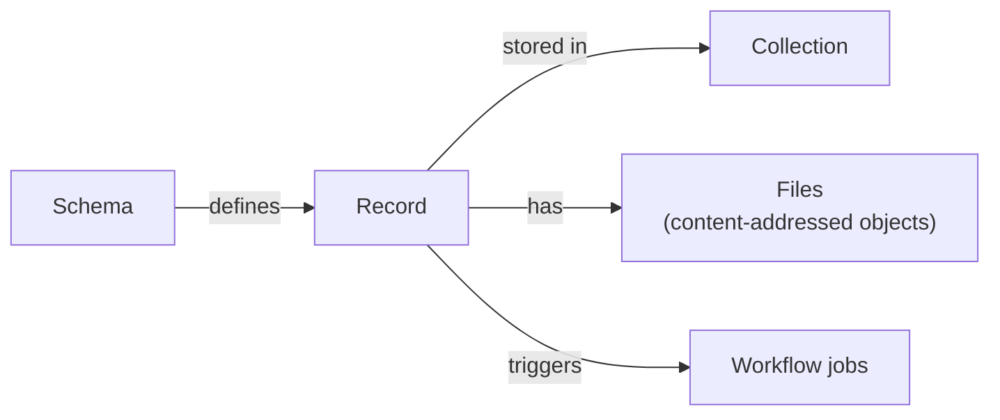

# civex

A local-first, command-line research data management system. Define schemas, collect records into collections, attach files, and automate processing with workflows — all on your own machine, with an optional web UI and HTTP server.



## Install

```bash
uv tool install civex
```

No Python needed: [uv](https://docs.astral.sh/uv/) fetches one for you. See [Install](https://civexdata.github.io/civex-docs/getting-started/install.html) for installing uv itself, other ways to install, and updating (`civex update`).

## 60-second example

```bash
civex init
civex schema create trial --description "A single experimental trial"
civex schema add-field trial subject --type string --required
civex collection create study-2024
civex record add --to study-2024 --schema trial
civex serve                          # open http://localhost:8000
```

Take the [five-minute tour](https://civexdata.github.io/civex-docs/getting-started/tour.html) for the full walkthrough, including workflows.

## Documentation

Full docs live in [`docs/`](https://civexdata.github.io/civex-docs/) — run `make docs` to browse them locally with live reload.

- **Getting started** — [install](https://civexdata.github.io/civex-docs/getting-started/install.html), [your first project](https://civexdata.github.io/civex-docs/getting-started/first-project.html), [five-minute tour](https://civexdata.github.io/civex-docs/getting-started/tour.html)
- **How-to** — [import data](https://civexdata.github.io/civex-docs/how-to/import-data.html), [put files on another drive](https://civexdata.github.io/civex-docs/how-to/storage-drives.html), [get files out](https://civexdata.github.io/civex-docs/how-to/export-files.html), [sync a project](https://civexdata.github.io/civex-docs/how-to/set-up-sync.html), [undo a mistake](https://civexdata.github.io/civex-docs/how-to/undo-mistakes.html), [back up a project](https://civexdata.github.io/civex-docs/how-to/back-up.html)
- **Guides** — [schemas & fields](https://civexdata.github.io/civex-docs/guides/schemas-and-fields.html), [collections & records](https://civexdata.github.io/civex-docs/guides/collections-and-records.html), [files](https://civexdata.github.io/civex-docs/guides/files.html), [workflows](https://civexdata.github.io/civex-docs/guides/workflows.html), [automation](https://civexdata.github.io/civex-docs/guides/automation.html), [server & web UI](https://civexdata.github.io/civex-docs/guides/server-and-web-ui.html), [PostgreSQL](https://civexdata.github.io/civex-docs/guides/postgresql.html), [logging & telemetry](https://civexdata.github.io/civex-docs/guides/logging-and-telemetry.html)
- **Reference** — built-in plugins (see the docs site's Reference section), [writing a plugin](https://civexdata.github.io/civex-docs/extending/writing-a-plugin.html), [container plugins](https://civexdata.github.io/civex-docs/extending/container-plugins.html), [wire protocol](https://civexdata.github.io/civex-docs/extending/wire-protocol.html), [plugin SDK](https://civexdata.github.io/civex-docs/extending/sdk-reference.html)
- **Contributing** — maintainer docs (dev setup, architecture, testing, release process) live in `docs/contributing/` in the repository, alongside `CONTRIBUTING.md`

## Development

```bash
make install   # uv sync — sets up the venv and dependencies
make check     # everything CI runs: format, lint, typecheck, test, docs build
```

See `docs/contributing/dev-setup.md` in the repository for the full local development workflow.

## License

civex is free to use for any purpose, including commercial use. Redistribution and modification are not permitted. See [LICENSE](LICENSE) for full terms.
