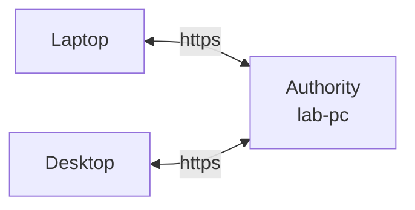

# Sync a project between computers

**Goal:** one computer (the **authority**) holds the shared copy of a project, and
other computers (**devices**) work on their own copies and stay in step with it.
Everything works offline: changes go when the authority can be reached.

This guide uses [Tailscale](https://tailscale.com) to give the authority a private
`https://` address, because devices only connect over HTTPS. It is free for
personal use and small teams, and needs nothing configured on the civex side.
(Already run a server? Put any HTTPS reverse proxy in front of
`civex serve --sync-only --host 127.0.0.1` instead, and skip step 1. Can you SSH
into the machine, such as a university lab machine? See
[Over SSH instead](#over-ssh-instead): nothing needs to run there.)



## 1. Install Tailscale everywhere

1. [Install Tailscale](https://tailscale.com/download) on the authority and on
   every device, signed in to the same account.
2. In the Tailscale admin console → **DNS**, turn on **MagicDNS** and **HTTPS
   Certificates**.

## 2. On the authority: accept a device

In the project folder:

```bash
civex sync authority enable
civex sync device invite laptop
```

```text
This project now accepts devices. Invite one with `civex sync device invite <name>`.
Invite for laptop (shown once, works until 2026-10-10T11:08:28+00:00):

  civex_inv_tQyt6v66…  (the full invite)

This authority's key: RMLC-CDV3
```

Copy the invite now: it is shown once, works once, and expires after 24 hours
(`--hours` changes that).

**In the app:** Settings → **Sync** → *Other devices following this project* →
**Accept devices**, then **Invite**.

## 3. On the authority: start the sync server

```bash
civex serve --sync-only --port 8100     # leave this running
```

In a second terminal:

```bash
tailscale serve --bg 8100
```

This prints the authority's address, such as `https://lab-pc.tail1234.ts.net`.

!!! warning "Point Tailscale at port 8100 only"
    `--sync-only` serves the sync API and nothing else. The full app (`civex serve`,
    port 8000) has no sign-in, so never expose it, and never use `tailscale funnel`,
    which publishes to the internet.

To use civex on the authority yourself at the same time, run `civex serve` as
usual in another terminal.

## 4. On the device: clone

```bash
civex clone https://lab-pc.tail1234.ts.net field-laptop --invite civex_inv_tQyt6v66…
cd field-laptop
civex sync status
```

```text
Authority   https://lab-pc.tail1234.ts.net
Project     84fbca56-a132-49af-939d-0bc1d820e168
Paused      no
Unsent      0
Conflicts   0
Files       keeps every file; 2 not downloaded yet
Last synced 2026-10-09T11:08:45+00:00
```

Records arrive first and the project is usable straight away. History and
files follow in the background.

The device is joined from now on. It signs in with a key of its own, so it never
needs the invite again.

**In the app:** Settings → **Sync**: paste the address and the invite, then
**Connect**. To fill an **empty** authority from a project that already has
data, connect that project the same way; it uploads everything.

## 5. Day to day

While `civex serve` runs on a device, it syncs by itself a few seconds after
each change and every minute otherwise. Without the app open:

```bash
civex sync now       # once
civex sync watch     # keep syncing in this terminal
```

```text
Received 2, sent 1
```

Keep the authority's `civex serve --sync-only` running (start it with the
computer: a login item, Task Scheduler or a systemd service). While it's down,
devices keep working and catch up later.

## 6. When two people change the same value

The authority's value stays. Yours is kept on your device until you decide:

```bash
civex sync now
```

```text
Received 2, sent 1
1 value(s) did not go in as made; see `civex sync conflicts`.
```

```bash
civex sync conflicts
```

```text
Id                                    Kind      What        Field  Yours      Theirs              State
9abf50d9-19ea-4f8d-88f7-c56e14eb5e5f  conflict  East Point  Site   South Bay  East Point (sulli)  open
```

Settle it with the id from that table:

```bash
civex sync resolve 9abf50d9-19ea-4f8d-88f7-c56e14eb5e5f --take mine   # or theirs
civex sync now
```

**In the app:** the status bar says when something is waiting. **Review** lists
it, and each record's **Resolve** tab shows both sides side by side, with
**Accept theirs** / **Accept yours** or an edit of your own.

Edits to *different* fields of the same record never clash: both go in.

## 7. Choose which files each computer keeps

By default a device downloads every file. For a large project, keep only what you
work on:

```bash
civex sync files                  # per collection: here, not here, the setting
civex sync files opened           # default: fetch a file only when it's opened
civex sync keep humpbacks         # but keep this collection's files here
civex sync free archive-2019      # remove local copies the server holds
```

A file that isn't here downloads when you open or export it.

## Over SSH instead

If you can SSH into the machine that holds the authority, a device can reach it
at an `ssh://` address, the way git reaches a remote. Nothing runs there between
syncs: each sync starts civex on that machine over SSH, and SSH carries the same
sync API.

On the machine you SSH into (once):

```bash
uv tool install "civex[server]"        # civex must be on PATH or in ~/.local/bin
cd ~/projects/birds && civex init      # or an existing project
civex sync authority enable
civex sync device invite laptop
```

On each device:

```bash
civex clone ssh://you@lab-machine/~/projects/birds --invite civex_inv_…
```

The address is `ssh://[user@]host[:port]/path`. `/~/` starts in your home folder,
`?civex=/path/to/civex` says where civex is if it is elsewhere, and hosts in your
`~/.ssh/config` work (`ssh://lab/~/birds`).

- **SSH must sign in without asking**, since syncing runs in the background: use a
  key (an agent is fine). If the machine asks for a password or a code every time,
  share one connection (`ControlMaster auto`, `ControlPersist 8h` in
  `~/.ssh/config`) and sign in to it once with `ssh lab`.
- **Accept the host key first:** run `ssh lab` once in a terminal.
- **One machine at a time.** Lab machines often share one home folder. While one
  serves the project it says so in `_civex/open-on-host.json`, and another refuses
  until two minutes after the last sync: two machines writing one database over a
  network drive can damage it. Use one machine's name in the address.
- **SSH forwarding must be allowed** (it is by default). If an administrator has
  turned it off, use Tailscale instead.
- civex there stops five minutes after the last request, and the next sync starts
  it again (about a second). `CIVEX_SSH_COMMAND` replaces `ssh`, as
  `GIT_SSH_COMMAND` does for git.

## Manage devices

```bash
civex sync device list            # devices, their key codes, waiting invites
civex sync device revoke laptop   # a lost laptop stops syncing at once
civex sync user "Dana"            # the name your changes are recorded under
```

## See also

- [Syncing between machines](../guides/sync.md): what syncs, the rules the
  authority enforces, sharing workflows, versions.
- [`civex sync` reference](../reference/cli/sync.md).
