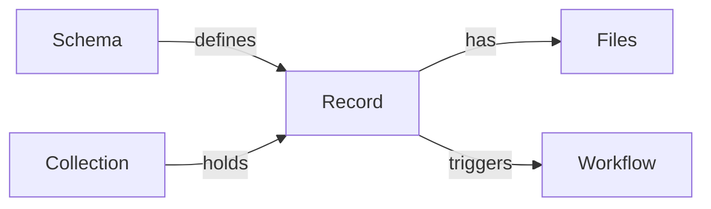

# Civex

Civex keeps research data in order on your own computer: typed records, the files
that belong to them, and workflows that process them. No cloud service and no
database administrator are needed. Use it from the web app or the command line.

## Start here

1. [Install](getting-started/install.md)
2. [Your first project](getting-started/first-project.md)
3. [Five-minute tour](getting-started/tour.md)

## I want to…

| | Guide |
|---|---|
| Bring in a spreadsheet or a folder of files | [Import data](how-to/import-data.md) |
| Fill fields from file names automatically | [Fill fields from file names](how-to/fill-fields-from-filenames.md) |
| Keep files on an external or network drive | [Put files on another drive](how-to/storage-drives.md) |
| Hand over files as a folder, zip or table | [Get files out](how-to/export-files.md) |
| Work on the same project from several computers | [Sync a project](how-to/set-up-sync.md) |
| Put back something changed or deleted | [Undo a mistake](how-to/undo-mistakes.md) |
| Back up a project | [Back up a project](how-to/back-up.md) |

## The pieces

| | What it is | Example |
|---|---|---|
| **Schema** | A kind of record: its fields and rules. Schemas nest | Encounter › Recording › Selection |
| **Field** | A typed value on a schema | `take` (integer), `audio` (file) |
| **Collection** | Holds records of the schemas it lists | `humpbacks-2024` |
| **Record** | One encounter, one recording… | *South Bay › Take 03* |
| **Volume** | A folder or drive where files are stored | `_civex/objects`, `/media/archive` |
| **Workflow** | YAML steps that run when records change | read a start time from a file name |
| **Authority** | The civex other computers sync with | `https://lab-pc.tail1234.ts.net` |

The [guides](guides/schemas-and-fields.md) explain each in depth, and the
[reference](reference/cli/index.md) lists every command and endpoint.
